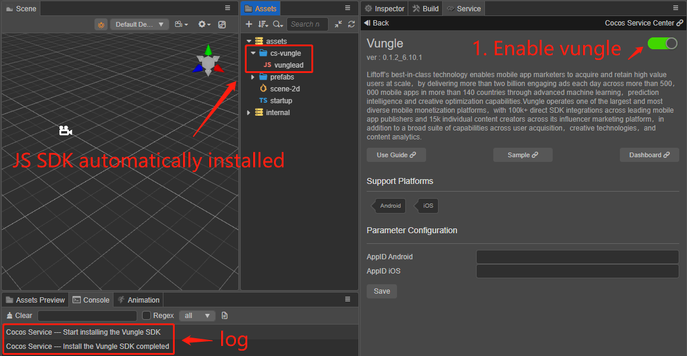
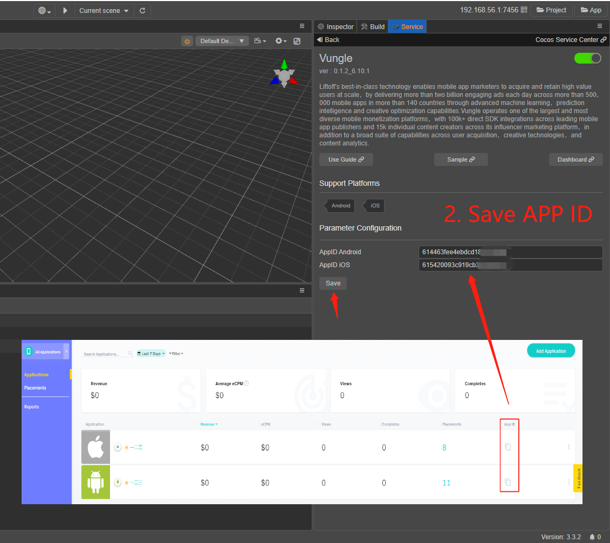
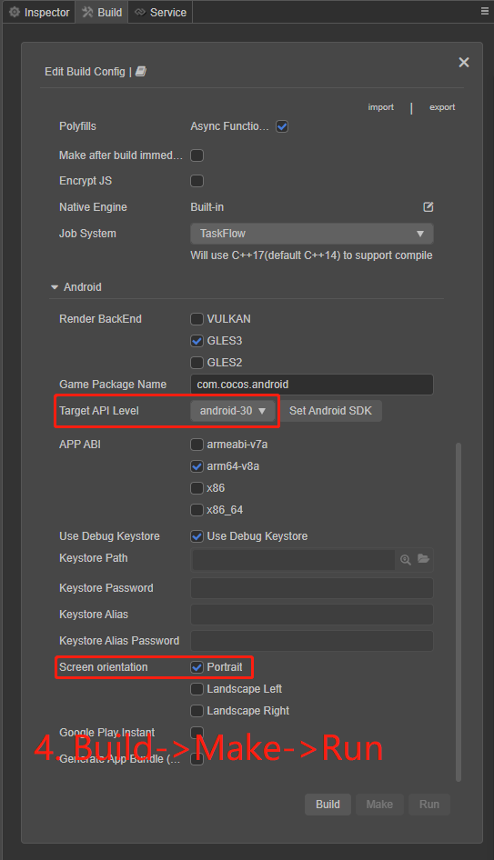

## Getting Started

This is a demo for vungle service provided by CocosCreator.
Please use creator version 3.x.x to run demo creator3, and version 2.x.x to run demo creator2.

First, download an Editor at [cocos.com](https://www.cocos.com/creator). If you are new to Cocos Creator, take a look at the [guide for beginners](https://docs.cocos.com/creator/manual/en/getting-started/).

### Run Demo

1. Enable Vungle Service

2. Save Vungle APP ID

3. use your own placement ID

4. Build->Make->Run project
   - Target API level: choose android-30 or higher
   - Screen orientation: This demo is designed as portrait

### Vungle JS API

After vungle service is enabled, JS SDK will be downloaded automatically. For more information, please refer to the following documents.
   - [Vungle Service: Getting Started](https://test-service.cocos.com/document/zh/vunglead.html)
   - [Vungle API](https://test-service.cocos.com/document/api/modules/vungle.html)
